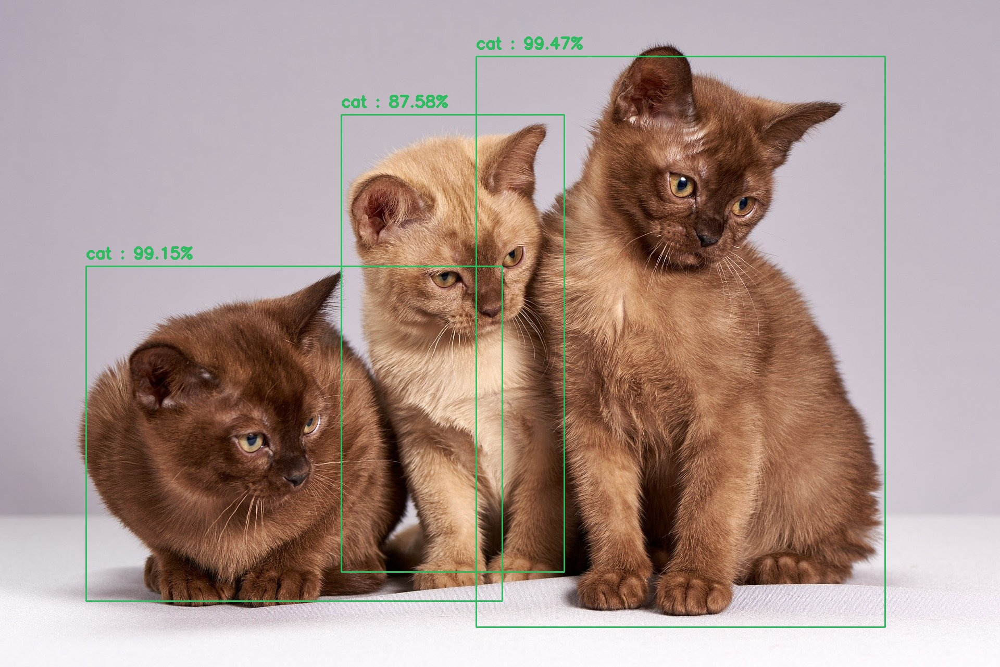
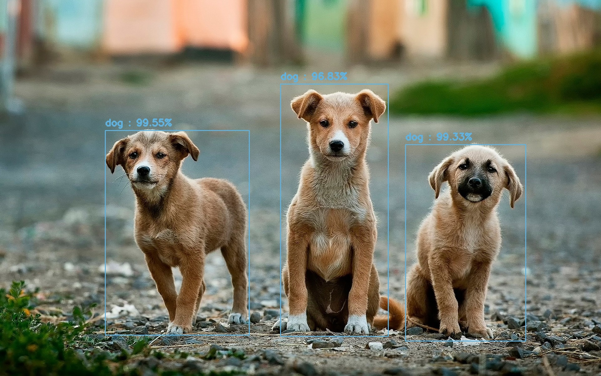

## MobileNet SSD
* #### 빠르고 효율적인 딥러닝 기반 Object Detection을 위해 MobileNet과 SSD를 결합한 MobileNet SSD를 사용
* #### 이미지를 분류하기 위한 CNN(Convolution Neural Network)의 MobileNet은 같은 레이어 수의 다른 CNN 구조에 비해 낮은 파라미터 수로 인하여 작은 응답 지연 시간을 가짐
* #### 객체 인식을 위한 딥러닝 모델 중 하나인 SSD(Single Shot Multibox Detector)는 입력한 하나의 이미지만 CNN을 실행하여 객체를 탐지

##### caffemodel 파일 : Object Detection을 위해 사전 훈련된 모델인 MobileNet SSD caffemodel을 사용(약 20개의 객체 인식)
##### prototxt 파일 : 모델의 레이어 구성 및 속성 정의
---
### 실행 환경
* #### Ubuntu
* #### OpenCV Version : 3.x.x
  * ##### 설치 : https://blog.naver.com/dldudcks1779/222020005648
---
## 이미지 객체 인식 시스템(Image Object Detection System)
* #### 이미지를 저장하지 않을 경우
  * sudo python3 object_detection_image.py --input 이미지 경로
    * 예) sudo python3 object_detection_image.py --input ./test_image/test_image_1.jpg
* #### 이미지를 저장할 경우
  * sudo python3 object_detection_image.py --input 이미지 경로 --output 저장할 이미지 경로
    * 예) sudo python3 object_detection_image.py --input ./test_image/test_image_1.jpg --output ./result_image/result_image_1.jpg

  

     
    
  

  

     
    
  

  

     
    
  

---
## 실시간 객체 인식 시스템(Real-Time Object Detection System) 
## 웹캠 또는 동영상(webcam or video)
* #### 비디오를 저장하지 않을 경우
  * webcam : sudo python3 real_time_object_detection.py
    * 예) sudo python3 real_time_object_detection.py
  * video : sudo python3 real_time_object_detection.py --input 비디오 경로
    * 예) sudo python3 real_time_object_detection.py --input ./test_video/test_video_1.mp4
* #### 비디오를 저장할 경우
  * webcam : sudo python3 real_time_object_detection.py --output 저장할 비디오 경로
    * 예) sudo python3 real_time_object_detection.py --output ./result_video/result_video_1.avi
  * video : sudo python3 real_time_object_detection.py --input 비디오 경로 --output 저장할 비디오 경로
    * 예) sudo python3 real_time_object_detection.py --input ./test_video/test_video_1.mp4 --output ./result_video/result_video_1.avi

---
